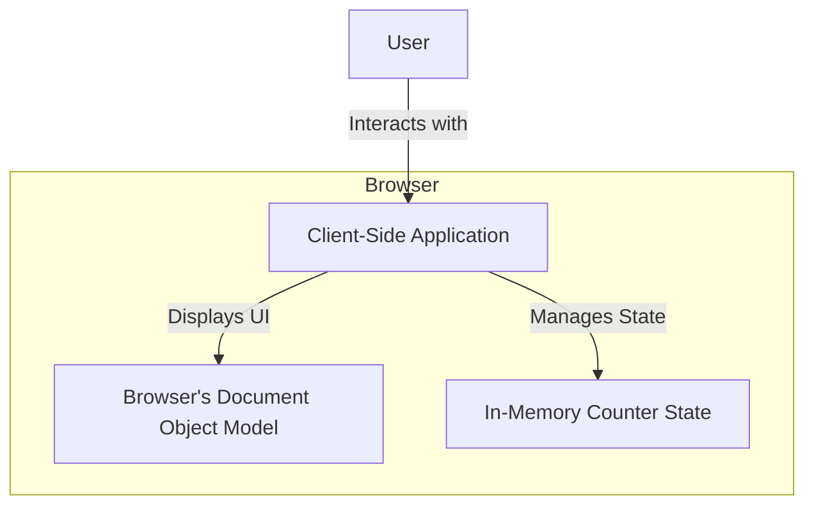

As a Senior Software Architect, I've reviewed the requirements for the "Simple Counter Button." This is a straightforward, client-side application with no immediate need for a backend or database. The primary focus will be on delivering a highly responsive and intuitive user experience through robust frontend development.

---

## Architecture Plan: Simple Counter Button

### 1. Executive Summary

The proposed architecture centers around a modern, reactive client-side application. Given the requirements for immediate responsiveness and no explicit persistence, a single-page application (SPA) approach using a lightweight JavaScript framework is ideal. This design minimizes complexity, ensures rapid development, and meets all functional and non-functional requirements efficiently without introducing unnecessary infrastructure.

### 2. High-Level Architecture Diagram



**Explanation:**
The user interacts directly with a client-side application loaded in their web browser. This application manages its own in-memory state for the counter and updates the Document Object Model (DOM) to reflect changes. There is no server-side component involved for the core functionality.

### 3. Architectural Drivers

*   **Responsiveness (NFR1):** Directly handled by client-side execution, avoiding network latency for state updates.
*   **User Experience (NFR2):** Achieved through a component-based frontend framework, allowing for clear separation of concerns and intuitive UI design.
*   **Simplicity & Maintainability:** A minimal tech stack and a focused client-side approach reduce development effort and long-term maintenance overhead.
*   **Initial State (FR3) & Increment (FR4):** Managed entirely within the client-side application's state.

### 4. Tech Stack

*   **Frontend (Required):**
    *   **HTML5:** For structuring the content and defining the button and display elements.
    *   **CSS3:** For styling the user interface, ensuring clarity and intuitiveness (NFR2).
    *   **JavaScript (ES6+):** For all application logic, event handling, and DOM manipulation.
    *   **Vue.js 3 (or React/Svelte):** A progressive JavaScript framework chosen for its reactivity, ease of use, component-based architecture, and lightweight nature. It naturally handles state management and DOM updates, directly addressing NFR1.
    *   **Build Tool:** Vite (recommended for Vue.js projects) or Webpack for bundling, transpiling, and dev server.
*   **Backend (Not Required):**
    *   **N/A:** The current requirements explicitly do not involve data persistence, user authentication, or complex business logic requiring a server. All operations occur client-side.
*   **Database (Not Required):**
    *   **N/A:** No data needs to be stored or retrieved beyond the current browser session. The counter's state is entirely in-memory.
*   **Deployment:**
    *   **Static Hosting:** Services like Netlify, Vercel, GitHub Pages, or AWS S3 + CloudFront are suitable for deploying the static HTML, CSS, and JavaScript files.

### 5. Components

The application will be structured using a component-based approach, typical for modern frontend frameworks.

#### 5.1. `App.vue` (Main Application Component)

*   **Responsibilities:**
    *   Acts as the root component, orchestrating the entire application.
    *   Manages the global `counterValue` state.
    *   Renders the `CounterDisplay` and `IncrementButton` components.
*   **Internal State:**
    *   `counterValue`: A number, initialized to `0` (FR3).
*   **Methods:**
    *   `incrementCounter()`: Increments `counterValue` by `1` (FR4).

#### 5.2. `CounterDisplay.vue`

*   **Responsibilities:**
    *   Displays the current value of the counter (FR2).
*   **Props:**
    *   `value`: The current integer value of the counter.
*   **Display Format:**
    *   Ensures the `value` is displayed as a non-negative integer (NFR3).

#### 5.3. `IncrementButton.vue`

*   **Responsibilities:**
    *   Displays a clickable button (FR1).
    *   Emits an event when clicked.
*   **Props (Optional):**
    *   `label`: Text to display on the button (e.g., "Click Me!").
*   **Events:**
    *   `@click`: Emits an event that the parent component (`App.vue`) listens to trigger the `incrementCounter` method.

#### Component Interaction Flow:

1.  `App.vue` initializes `counterValue` to `0`.
2.  `App.vue` passes `counterValue` as a prop to `CounterDisplay.vue`.
3.  `App.vue` renders `IncrementButton.vue`.
4.  User clicks `IncrementButton.vue`.
5.  `IncrementButton.vue` emits a `click` event.
6.  `App.vue` listens for the `click` event and calls its `incrementCounter()` method.
7.  `incrementCounter()` updates `counterValue`.
8.  Due to Vue.js's reactivity, `CounterDisplay.vue` automatically re-renders with the new `counterValue`, updating the UI instantly (NFR1).

### 6. Data Model / Database Schema

*   **Database Schema:** Not Applicable.
*   **In-Memory Data Model:**
    *   The sole piece of data is the `counterValue`, an integer.
    *   This state resides entirely in the browser's memory for the duration of the page session.

```typescript
// Example In-Memory State Structure (within App.vue component)
interface CounterState {
    counterValue: number; // Represents the current counter value (non-negative integer)
}

// Initial State:
const initialState: CounterState = {
    counterValue: 0, // FR3
};
```

### 7. API Design

*   **External APIs:** Not Applicable. No external services or backend APIs are required for the specified functionality.
*   **Internal Component APIs (Props & Events):**
    *   **`App.vue` -> `CounterDisplay.vue`:**
        *   **Props:** `value: number`
        *   **Example Usage:** `<CounterDisplay :value="counterValue" />`
    *   **`App.vue` <- `IncrementButton.vue`:**
        *   **Events:** `@click` (emitted by the button, handled by the parent)
        *   **Example Usage:** `<IncrementButton @click="incrementCounter" />`

This internal API ensures clear communication and separation of concerns between components, adhering to good frontend architecture principles.

### 8. Future Considerations (Beyond Current Scope)

While not required by the current document, a Senior Architect would consider potential future enhancements:

*   **Persistence:** If the counter needs to retain its value across browser sessions, integrate `localStorage` or session storage.
*   **Reset Functionality:** Add a "Reset" button to set the counter back to 0.
*   **Decrement Functionality:** Add a "Decrement" button.
*   **Styling & Theming:** Implement more sophisticated CSS (e.g., utility frameworks like Tailwind CSS, or component libraries) for enhanced aesthetics.
*   **Accessibility (A11y):** Ensure proper ARIA attributes and keyboard navigation for users with disabilities.
*   **Multiple Counters:** Develop a mechanism to manage multiple independent counters on the same page.
*   **Testing:** Implement unit tests for components and integration tests for the overall interaction.

This architecture provides a robust, efficient, and scalable foundation for the "Simple Counter Button" while being mindful of potential future growth.