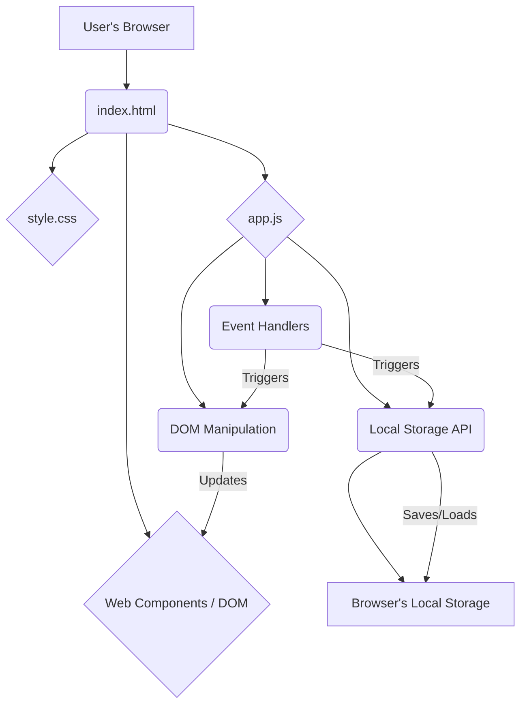

As a Senior Software Architect, I've reviewed the requirements for the Interactive Todo Application. Given the concise nature of the functional and non-functional requirements (specifically NFR1: Interactivity, and the lack of explicit persistence or multi-user features), a purely client-side architecture with local storage for basic persistence is the most efficient and appropriate solution. This approach meets all stated requirements without unnecessary complexity or overhead, while providing a clear path for future expansion.

---

## Architecture Plan: Interactive Todo Application

### 1. Overall Architecture

The application will be a **Single-Page Application (SPA)**, primarily client-side driven. It will leverage standard web technologies (HTML, CSS, JavaScript) to provide an interactive user experience. For basic persistence across browser sessions, the Web Storage API (specifically `localStorage`) will be used. There is no server-side component required for the current set of requirements.



### 2. Tech Stack

*   **Frontend Framework/Library:** Vanilla JavaScript
    *   *Rationale:* For the given minimal requirements, a full-fledged framework (like React, Vue, Angular) would introduce unnecessary complexity and bundle size. Vanilla JS provides the most lightweight and direct way to achieve the specified interactivity.
*   **Markup Language:** HTML5
*   **Styling:** CSS3
*   **Client-Side Persistence:** Web Storage API (`localStorage`)
    *   *Rationale:* Provides simple key-value storage within the user's browser, allowing tasks to persist even if the browser is closed and reopened. This directly addresses the "interactive user experience" by preventing loss of data on refresh/revisit without requiring a backend.
*   **Build Tools (Optional for initial scope):** None initially. For larger client-side apps, Webpack or Vite could be introduced for bundling and optimization, but are not necessary here.

### 3. Components

The application will be structured into logical components, primarily within the `app.js` file for this simple scope.

#### 3.1. UI Components (HTML Structure)

These are the elements that users interact with, defined in `index.html`.

*   **`Todo Checklist Page` (FR1):**
    *   An `index.html` file serving as the main entry point.
    *   A main container (`div` or `main`) for the application.
*   **`Task Input Field` (FR2):**
    *   `<input type="text" id="todoInput" placeholder="Add a new task...">`
*   **`Add Task Button` (FR3):**
    *   `<button id="addBtn">Add Task</button>`
*   **`Todo List Container` (FR4):**
    *   `<ul id="todoList"></ul>`
*   **`Todo Item` (Dynamically Generated):**
    *   Each task appended to `#todoList` will be an `<li>` element containing the task text.
    *   Example: `<li>Learn Architecture Plan</li>`

#### 3.2. Application Logic Components (JavaScript - `app.js`)

These components handle the behavior and data management.

*   **`DOMContentLoaded` Listener:**
    *   Initializes the application when the DOM is fully loaded.
    *   Loads existing tasks from `localStorage`.
    *   Attaches event listeners to UI elements.
*   **`TodoStore`:**
    *   **Purpose:** Manages the array of todo items in memory and orchestrates persistence.
    *   **Responsibilities:**
        *   Holds the current list of tasks as an array of objects (e.g., `[{ id: 'uuid-1', text: 'Task 1' }]`).
        *   Adds new tasks to the array.
        *   Coordinates saving and loading with `LocalStorageService`.
*   **`DOMManager`:**
    *   **Purpose:** Handles all interactions with the Document Object Model (DOM).
    *   **Responsibilities:**
        *   `renderTodoList(todos)`: Clears `#todoList` and renders all tasks from the `TodoStore`.
        *   `appendTodoItem(todo)`: Appends a new `<li>` element to `#todoList` (FR4).
        *   `getInputValue()`: Retrieves text from `#todoInput`.
        *   `clearInputField()`: Clears the `#todoInput` field (FR5).
*   **`EventHandler`:**
    *   **Purpose:** Listens for user interactions and triggers appropriate `TodoStore` and `DOMManager` actions.
    *   **Responsibilities:**
        *   Listens for `click` events on `#addBtn` (FR3).
        *   When `#addBtn` is clicked:
            1.  Gets text from `#todoInput`.
            2.  Calls `TodoStore.addTodo()`.
            3.  Calls `DOMManager.appendTodoItem()` to render the new task (FR4).
            4.  Calls `DOMManager.clearInputField()` (FR5).
            5.  Calls `TodoStore.saveTodos()` to persist the updated list.
*   **`LocalStorageService`:**
    *   **Purpose:** An abstraction layer for interacting with the browser's `localStorage`.
    *   **Responsibilities:**
        *   `save(key, data)`: Stores `data` (JSON stringified) under `key` in `localStorage`.
        *   `load(key)`: Retrieves and parses data from `localStorage` by `key`.

### 4. Database Schema (Conceptual - Local Storage)

Since a traditional backend database is not used, the "schema" refers to the structure of the data stored in the browser's `localStorage`.

*   **Key:** `todos`
*   **Value:** A JSON string representation of an array of Todo objects.

**Conceptual `Todo` Object Structure:**

```json
[
  {
    "id": "unique-uuid-1",
    "text": "Plan architecture for Todo App"
  },
  {
    "id": "unique-uuid-2",
    "text": "Implement interactive UI"
  },
  {
    "id": "unique-uuid-3",
    "text": "Test functionality"
  }
]
```

*   **`id` (String):** A unique identifier for each todo item (e.g., using `crypto.randomUUID()` for robust client-side ID generation). This is good practice for future extensibility (e.g., delete, update, reorder).
*   **`text` (String):** The actual task description entered by the user.

### 5. API Design (Internal JavaScript API)

There is no external HTTP API as the application is purely client-side. The API refers to the public methods and interactions between the JavaScript components.

#### `app.js` (Main Entry Point / Orchestrator)

*   `init()`:
    *   Purpose: Initializes the application on page load.
    *   Flow: `LocalStorageService.load('todos')` -> `TodoStore.setTodos()` -> `DOMManager.renderTodoList()` -> `EventHandler.attachListeners()`.
*   `handleAddTodoClick()`:
    *   Purpose: Event handler for the `#addBtn` click.
    *   Flow: `DOMManager.getInputValue()` -> `TodoStore.addTodo()` -> `DOMManager.appendTodoItem()` -> `DOMManager.clearInputField()` -> `TodoStore.saveTodos()`.

#### `TodoStore`

*   `addTodo(text)`: Adds a new todo item to the internal array.
*   `getTodos()`: Returns the current array of todo items.
*   `setTodos(todosArray)`: Sets the internal todo array (typically used on initial load).
*   `saveTodos()`: Calls `LocalStorageService.save('todos', this.todos)`.

#### `DOMManager`

*   `renderTodoList(todos)`: Replaces the content of `#todoList` with the provided `todos` array.
*   `appendTodoItem(todo)`: Creates an `<li>` element for a single `todo` object and appends it to `#todoList`.
*   `getInputValue()`: Returns the current value of `#todoInput`.
*   `clearInputField()`: Sets the value of `#todoInput` to an empty string.

#### `LocalStorageService`

*   `save(key, data)`:
    *   Signature: `save(key: string, data: any[]) => void`
    *   Action: `localStorage.setItem(key, JSON.stringify(data))`
*   `load(key)`:
    *   Signature: `load(key: string) => any[] | null`
    *   Action: `JSON.parse(localStorage.getItem(key))`

---

This architecture plan provides a robust, yet minimalist, solution that fully addresses all specified functional and non-functional requirements, with local storage ensuring a truly interactive and persistent user experience within the browser. It also lays a clear foundation for potential future enhancements like task completion, deletion, or even a full backend integration.